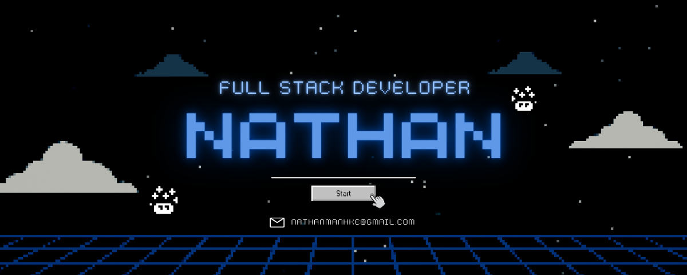
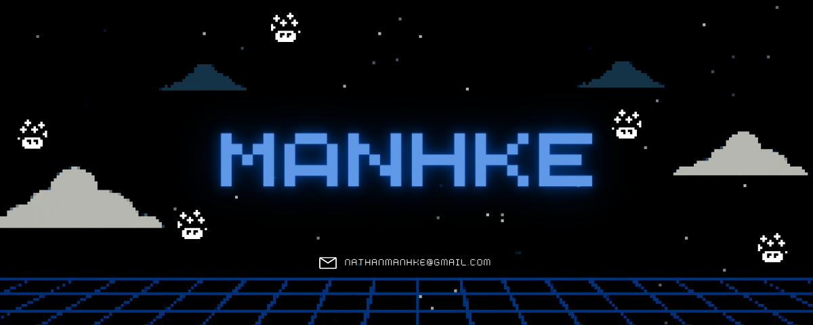

  

  
  

  
 

## 🙋🏼‍♂️ Sobre mim

  <b>"Somos o que fazemos repetidamente. A excelência não é um feito, é um hábito." - Aristóteles</b>

 

Oi, tudo bem? Pode me chamar de Nathan!   
Sou desenvolvedor Full Stack formado em sistemas para internet. Atualmente trabalho principalmente com Front-end, mas ainda sim com um pouco de Back-end. Estou aprimorando meus conhecimentos em JavaScript e TypeScript.

  

## 💻 Main Skills
 

    
    
    
    
    
  

   

  ## ⚙️ Tools
&nbsp;
&nbsp;
&nbsp;

  
   
  
## 📚 Studying in this moment
&nbsp;
&nbsp;

   
  
  
   
  

  

  

